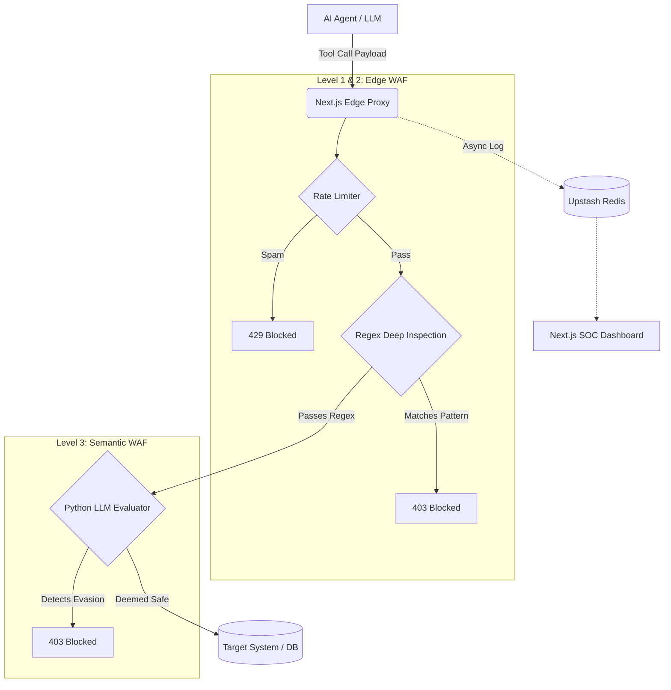

# Sentinel: AI Agent Security Gateway


---

## ⚠️ The Problem

AI Agents using MCP create a massive new attack surface that traditional Web Application Firewalls (WAFs) are blind to.

- **Tool-Call Vulnerability:** Agents can invoke real-world tools, allowing them to execute shell scripts, query databases, or read local files.
- **The Intent Gap:** Conventional firewalls inspect HTTP signatures but have no understanding of tool-call intent.
- **Evasion Tactics:** Prompt injections disguised as natural language or destructive commands buried in Base64 bypass standard filters, leading to potential data exfiltration or system compromise.

---

### 🛡️ The Solution: Defense-in-Depth

- **Level 1 — Rate Limiting:** Per-IP sliding window enforced at the edge via Upstash Redis. Blocks spam and looping agents before any payload inspection occurs.
- **Level 2 — Deterministic WAF:** Sub-10ms regex inspection of `params.arguments` at the edge. Per-tool pattern dictionaries catch path traversal, shell injection, SQL destruction, and sandbox escapes deterministically.
- **Level 3 — Semantic Evaluator:** A Python LLM sidecar (FastAPI + GPT-4o-mini) catches what regex cannot — prompt injections, base64-obfuscated payloads, and novel evasion. Implements a circuit breaker: fails closed on timeout or service error.

---

## Architecture



---

## Tech Stack

- **Next.js 15** — App Router with Edge Middleware for zero-cold-start enforcement at the network boundary
- **Python + FastAPI** — Lightweight async microservice hosting the Level 3 LLM evaluator
- **Upstash Redis** — Serverless Redis for rate limiting, tool blocklisting, and log persistence
- **OpenAI GPT-4o-mini** — LLM backend for semantic payload analysis (swappable with any OpenAI-compatible model)

---

## Quick Start

### Prerequisites
- Node.js 18+
- Python 3.10+
- An [Upstash](https://upstash.com) Redis database (free tier)
- An [OpenAI](https://platform.openai.com) API key

### 1. Clone and install

```bash
git clone https://github.com/YOUR_USERNAME/mcp-agent-firewall.git
cd mcp-agent-firewall
npm install
```

### 2. Configure environment variables

```bash
# Root — Next.js app
cp .env.example .env.local
# Fill in UPSTASH_REDIS_REST_URL and UPSTASH_REDIS_REST_TOKEN

# Python evaluator
cp firewall-llm/.env.example firewall-llm/.env
# Fill in OPENAI_API_KEY
```

### 3. Start the Next.js app

```bash
npm run dev
# → http://localhost:3000
```

### 4. Start the Python evaluator

```bash
cd firewall-llm
python -m venv venv
source venv/bin/activate   # Windows: venv\Scripts\activate
pip install -r requirements.txt
uvicorn main:app --port 8001 --reload
# → http://localhost:8001
```

Both services must be running for all three security layers to be active. The dashboard is available at [http://localhost:3000](http://localhost:3000).
